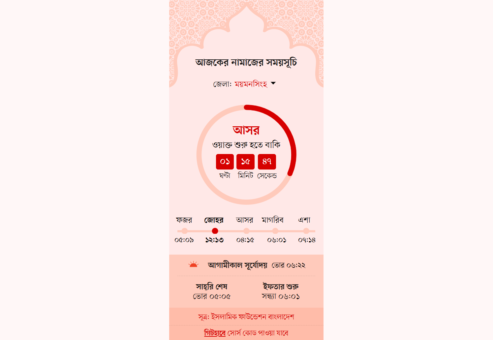

# Prayer Time Widget — Bangladesh

A lightweight, embeddable daily prayer time widget for Bangladesh, built with **Next.js** and **TypeScript**. Displays accurate prayer times in Bangla for all 64 districts, sourced from **Islamic Foundation Bangladesh**.

---

## What It Does

- Shows today's **Fajr, Dhuhr (or Jumu'ah), Asr, Maghrib, and Isha** prayer times
- Displays **Sehri**, **Iftar**, and **Sunrise** times with contextual labels (today/tomorrow)
- Highlights the **current prayer** using an animated interactive spinner
- Supports **district selection** — users can switch between all 64 districts of Bangladesh
- All times and numerals are displayed in **Bangla**

---

## How It Works

1. **Data** is fetched from the Prothom Alo prayer time API and cached in `localStorage` for the day — no redundant network calls on reload
2. **District offsets** are applied: each district has its own Sehri and Iftar adjustment (in minutes) relative to the base API times
3. The **Spinner** component tracks the current time and automatically highlights the active prayer slot
4. On **Friday**, Dhuhr is automatically relabeled as **Jumu'ah**
5. The **header image** is embedded directly as an inline SVG — not a separately fetchable static file

---

## Technologies

| Technology | Purpose |
|---|---|
| [Next.js 16](https://nextjs.org) | Framework (App Router) |
| [React 19](https://react.dev) | UI rendering |
| [TypeScript](https://www.typescriptlang.org) | Type safety |
| CSS Modules + Global CSS | Scoped and global styling |
| `localStorage` | Client-side caching of daily prayer data |
| `webpack-obfuscator` | Production JS obfuscation |

---

## Source

Prayer times sourced from Islamic Foundation of Bangladesh via the Prothom Alo API.